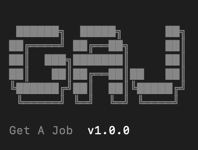

<p align="center">
  
</p>

A Claude Code skill that runs detective research on every job opportunity before it hits your pipeline.

## What this is

GAJ manages your job search from the terminal. When you add a job or respond to a recruiter, it launches parallel research agents that investigate the company, verify compensation against market data, check the recruiter's reputation, and identify unnamed clients from staffing firms. A recruiter says "leading global supplier of electronic components" and GAJ cross-references the industry, tech stack, geography, and salary band to tell you it's probably Avnet.

The research stays secret. Outbound messages never reference what GAJ found. You know who the client is, what the market pays, and whether the recruiter is legitimate. They don't know you know.

Beyond detective work: pipeline tracking across 10 sub-commands, cover letter generation, salary negotiation with the Ackerman model, correspondence history, and batch triage for job alert digests. All data lives on your machine in SQLite. No external APIs, no server costs.

## Install

Requires [Claude Code](https://claude.ai/claude-code).

```bash
npx skills add stackproof/GAJ
```

## Quick start

First time you run `/gaj`, setup runs automatically:

1. Creates `~/gaj/` with database and config
2. Seeds salary data (27 roles across levels and locations)
3. Generates `~/gaj/context/about-me.md` for personalized output

Fill in `about-me.md` with your target roles, salary floor, and key achievements.

## Commands

| Command | What it does |
|---------|-------------|
| `/gaj` | Pipeline dashboard |
| `/gaj:add` | Add a job (runs detective research first) |
| `/gaj:list` | List and filter pipeline items |
| `/gaj:status` | Update a job's status |
| `/gaj:search` | Search by company, title, or keyword |
| `/gaj:stats` | Pipeline statistics |
| `/gaj:cover-letter` | Generate a Hook/Proof/Close cover letter |
| `/gaj:respond` | Assess interest, research the opportunity, draft a response |
| `/gaj:negotiate` | Ackerman-based salary negotiation with market data |
| `/gaj:sync` | Export pipeline to Google Sheets |
| `/gaj:triage` | Batch-score and filter job alert digests |

Natural language works too. "Add Nexus senior engineer" routes to `gaj:add`. "What's in my pipeline?" routes to `gaj:list`.

## Examples

**Add a job (detective research runs automatically):**

```
> /gaj:add Senior Platform Engineer at a staffing firm, $190k, found on LinkedIn

Launching research agents...
  - Recruiter: 4 years at firm, specialized in cloud infra, clean Glassdoor
  - Company: Staffing firm withholds client name
  - Mystery client: Cross-referencing "cloud-native platform" + "Series C" +
    "$190k base" + "Austin preferred" against known companies...
    → 78% match: DataStax. Evidence: tech stack, salary band, location, headcount.
  - Comp check: $190k is 95th percentile for Austin senior platform eng. Legit.
  - Stack fit: 4/5 criteria match your about-me.md profile

Detective Report:
| Signal        | Finding                              | Confidence |
|---------------|--------------------------------------|------------|
| Client ID     | Likely DataStax (Series C, Austin)   | 78%        |
| Comp vs market| At 95th percentile for role/location | High       |
| Recruiter     | Legitimate, 4yr tenure, clean record | High       |
| Red flags     | None detected                        | -          |

Added to pipeline: ID 7, pending-review
```

**Respond to a recruiter:**

```
> /gaj:respond Got a message from a recruiter about a Staff ML role, comp not mentioned

[Runs detective research: recruiter reputation, company intel, comp estimate]
[Presents findings, then assesses interest on 5 criteria]

Interest: curious (3/5 criteria met, missing comp and stack details)

Draft response (curious mode, 127 words):
"The ML infrastructure work sounds interesting, especially the real-time
serving layer. I have a few questions before committing time to a call..."

[Logs inbound + outbound correspondence, linked to pipeline entry]
```

**Triage a LinkedIn digest:**

```
> /gaj:triage [paste 6 jobs from LinkedIn alert]

| # | Company     | Role              | Score | Verdict |
|---|-------------|-------------------|-------|---------|
| 1 | Meridian    | Staff Engineer    | 8.2   | PURSUE  |
| 2 | Cobalt AI   | Senior ML Eng     | 7.1   | PURSUE  |
| 3 | TechForce   | Platform Lead     | 5.4   | MAYBE   |
| 4 | GlobalSync  | Senior Developer  | 4.0   | MAYBE   |
| 5 | Recruitify  | "AI Engineer"     | 2.1   | SKIP    |
| 6 | StaffMax    | Contract Dev      | 1.8   | SKIP    |

Run detective research on your picks? [1, 2, or both]
```

## How it works

All data lives on your machine:

- **Database:** `~/gaj/gaj.db` (SQLite)
- **Config:** `~/gaj/config.yaml`
- **Context:** `~/gaj/context/about-me.md` (your profile for personalized output)

The CLI at `scripts/pipeline-cli.ts` handles database operations. Skills read from and write to the database through this CLI.

**Detective research** launches parallel agents on every job add and recruiter response. The agents investigate recruiter legitimacy, identify unnamed clients by cross-referencing JD clues against known companies, verify compensation against seeded market data, and flag red flags. Findings are stored in the `job_data` field for each pipeline entry and persist across sessions.

**Writing quality** is enforced automatically on every piece of generated text. Cover letters, recruiter responses, and negotiation language all pass through anti-AI rules before you see them. No em dashes, no "delve," no "I hope this helps." There is no separate humanize step because nothing leaves the box sounding like a bot wrote it.

## Google Sheets sync

Optional. Requires your own Google Cloud credentials.

1. Enable the Google Sheets API in [Google Cloud Console](https://console.cloud.google.com)
2. Create a service account and download credentials
3. Save to `~/gaj/credentials.json`
4. Update `~/gaj/config.yaml` with your sheet ID
5. Run `/gaj:sync`

## Job statuses

`pending-review` > `approved` > `cover-letter-ready` > `applied` > `interview` > `offer`

Side tracks: `rejected`, `expired`, `filtered`

## Built by

[StackProof](https://stackproof.app) builds tools for engineers who take their job search seriously. GAJ is the open-source foundation. StackProof adds recruiter intelligence, application tracking analytics, and a web interface.

## License

MIT
